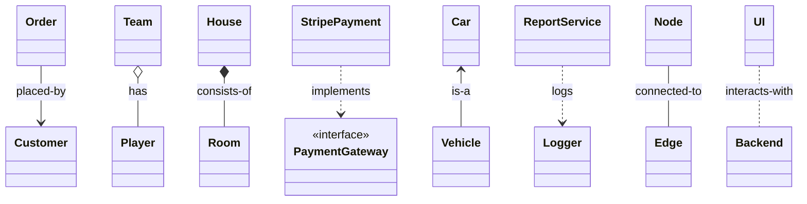

```mermaid
classDiagram

    %% 1. Zero to many (0..*)
    class Customer
    class Order
    Customer "1" --> "0..*" Order : places
    %% “I can manage without you… but I can also have many of you.â€

    %% 2. One to many (1..*)
    class Library
    class Book
    Library "1" --> "1..*" Book : has
    %% “I need at least one of you… maybe many more.â€

    %% 3. Zero or one (0..1)
    class User
    class Profile
    User "1" --> "0..1" Profile : has
    %% “I may have you… or I may not.â€

    %% 4. Exactly one (1)
    class Car
    class Engine
    Car "1" *-- "1" Engine : contains
    %% “I need exactly one of you… no more, no less.â€

    %% 5. Zero to n (0..n)
    class Course
    class Module
    Course "1" --> "0..10" Module : includes
    %% “I don’t really need you… but I might have a limited number of you.â€

    %% 6. One to n (1..n)
    class Batch
    class Student
    Batch "1" --> "1..60" Student : admits
    %% “I must have a few of you, but not too many.â€

    %% 7. Exactly n (n)
    class Triangle
    class Side
    Triangle "1" --> "3" Side : has
    %% “I must have this exact number of you.â€

```

# Quick Guide: OOP Principles

> ***You said OOP, I heard AEIP***
> **A → Abstraction**
> **E → Encapsulation**
> **I → Inheritance**
> **P → Polymorphism**

## Real Life Analogy for Class & Object

### 🧱 Class and Object — Blueprint Analogy

In programming, the concepts of **class** and **object** can be understood through a simple real-world analogy:

> **A class is like a blueprint, and an object is like a house built from that blueprint.**

### 🏗️ Analogy: The Blueprint and the House

#### 📐 Class (The Blueprint)

A **class** is a template or design that defines the **common properties and behaviors** of a specific type of thing.

A house blueprint specifies:

##### Properties (Attributes)

* Size of rooms
* Number of windows
* Type of roofing material
* Color of paint

##### Behaviors (Methods)

* How the electrical system functions
* Where the plumbing runs
* How doors open and close

👉 The blueprint itself is **not a real house** you can live in — it is just a **plan**.


#### 🏠 Object (The House)

An **object** is a **real, concrete instance** created using the class (blueprint).

From the same blueprint, you can build many different houses:

* **Instance 1 (House A)**

  * Green paint
  * Three bedrooms
  * Two-car garage
* **Instance 2 (House B)**

  * Blue paint
  * Three bedrooms
  * Single-car garage

✔ Both houses follow the **same blueprint**, but
✔ Each has its **own unique characteristics**, and
✔ Exists **independently** in the real world.

### 🔁 Induction: From Concept to Code

This analogy maps directly to programming terminology:

| Concept         | Analogy                     | Programming Term            | Description                                                                                                       |
| --------------- | --------------------------- | --------------------------- | ----------------------------------------------------------------------------------------------------------------- |
| Plan            | Blueprint                   | **Class**                   | Defines the structure and capabilities (fields and methods) of objects. Acts as a factory for creating instances. |
| Instance        | A specific house            | **Object**                  | A concrete entity created from a class. Holds its own state and can perform actions.                              |
| Characteristics | Paint color, room size      | **Attributes / Properties** | Variables inside the class that store an object’s unique state.                                                   |
| Actions         | Open doors, use electricity | **Methods / Behaviors**     | Functions that define what an object can do.                                                                      |

### ✅ Summary

* A **Class** is defined **once** to describe structure and behavior.
* **Objects** are created from that class.
* Each object:

  * Shares the same structure
  * Maintains its **own state**
  * Operates independently

> **Class = Blueprint**
> **Object = House built from it**

---

## Abstraction

Abstraction is the concept of hiding complex implementation details and showing only the necessary features of an object. This is achieved using **abstract classes** and **interfaces**. They define a contract without providing full implementation.

**Keywords / Concepts:** `abstract`, `interface`

**Interviewer Point:**

> *"Abstraction defines the 'what' without specifying the 'how', creating a clear contract for implementation."*

### C# Syntax Example (Using Abstract Class)

```csharp
// The 'abstract' class cannot be instantiated itself
public abstract class Shape
{
    // Can contain implemented methods
    public abstract double CalculateArea(); // Abstract method (no body)

    public void Display()
    {
        Console.WriteLine($"This is a shape with Area: {CalculateArea()}");
    }
}

public class Circle : Shape
{
    public double Radius { get; set; }

    // Must implement the abstract method
    public override double CalculateArea()
    {
        return Math.PI * Radius * Radius;
    }
}
```

### C# Syntax Example (Using Interface)

```csharp
// Interface defines ONLY the contract
public interface IShape
{
    // No implementation, only signature
    double CalculateArea();
}

// Class implements the interface
public class Rectangle : IShape
{
    public double Length { get; set; }
    public double Width { get; set; }

    // Must implement ALL interface members
    public double CalculateArea()
    {
        return Length * Width;
    }
}

// Usage
class Program
{
    static void Main()
    {
        IShape shape = new Rectangle
        {
            Length = 10,
            Width = 5
        };

        Console.WriteLine($"Area: {shape.CalculateArea()}");
    }
}
```
---

## Encapsulation

Encapsulation is the principle of bundling the data (fields) and methods that operate on that data within a single unit (a class). It involves restricting direct access to some of an object's components, typically using access modifiers and properties.

**Keywords / Concepts:** `public`, `private`, `protected`, `internal`, `properties`

**Interviewer Point:**

> *"Encapsulation guarantees that internal state is protected from unauthorized outside access."*

### C# Syntax Example

```csharp
public class BankAccount
{
    // Private field: the data is hidden
    private decimal _balance;

    // Public Property: controlled access to the data (encapsulated)
    public decimal Balance
    {
        get { return _balance; }
        // We can add validation logic here before setting the value
        private set
        {
            if (value >= 0)
            {
                _balance = value;
            }
        }
    }

    // Method to modify the balance safely
    public void Deposit(decimal amount)
    {
        if (amount > 0)
        {
            Balance += amount;
        }
    }
}
```
---

## Inheritance

Inheritance is a mechanism that allows a new class (derived class or subclass) to inherit properties and methods from an existing class (base class or superclass). This promotes code reuse and models a "is-a" relationship.

**Keywords/Concepts:** `:` (colon for inheritance), `base`, `sealed`.

**Interviewer point:** "Inheritance helps establish an 'is-a' relationship, where a `Dog` *is an* `Animal`."

**C# Syntax Example:**

```csharp
// Base Class
public class Animal
{
    public string Name { get; set; }

    public void Eat()
    {
        Console.WriteLine($"{Name} is eating.");
    }
}

// Derived Class: Uses the colon syntax for inheritance
public class Dog : Animal 
{
    public void Bark()
    {
        Console.WriteLine($"{Name} is barking 'Woof!'");
    }
}

// Usage: 
// Dog myDog = new Dog { Name = "Fido" };
// myDog.Eat();   // Inherited from Animal
// myDog.Bark();  // Specific to Dog
```

---

## Polymorphism

Polymorphism literally means **"many forms."** It allows objects of different classes that are related by inheritance to be treated as objects of a common base class. In C#, this is achieved through method overloading and overriding.

**Keywords / Concepts:** `virtual`, `override`, Method Overloading

**Interviewer Point:**

> *"Polymorphism lets a single interface represent different underlying forms, allowing us to treat derived classes as their base type at runtime."*

### Compile-Time Polymorphism (Method Overloading)

Compile-time polymorphism is achieved using **method overloading**, where **multiple methods have the same name but different parameter lists**.

The method call is resolved **at compile time**, not runtime.

#### C# Syntax Example (Compile-Time Polymorphism via Overloading)

```csharp
public class Calculator
{
    // Same method name, different parameter types
    public int Add(int a, int b)
    {
        return a + b;
    }

    // Overloaded method with different number of parameters
    public int Add(int a, int b, int c)
    {
        return a + b + c;
    }

    // Overloaded method with different parameter types
    public double Add(double a, double b)
    {
        return a + b;
    }
}

class Program
{
    static void Main()
    {
        Calculator calculator = new Calculator();

        Console.WriteLine(calculator.Add(2, 3));        // Calls Add(int, int)
        Console.WriteLine(calculator.Add(1, 2, 3));     // Calls Add(int, int, int)
        Console.WriteLine(calculator.Add(2.5, 3.5));    // Calls Add(double, double)
    }
}
```

### Run-Time Polymorphism (Method Overriding)

Method overriding is a feature of **runtime polymorphism** where a **derived class provides its own implementation of a method defined in its base class**. The base class method must be marked with `virtual`, and the derived class method must use `override`.

The method that gets executed is decided **at runtime**, based on the **actual object type**, not the reference type.

#### C# Syntax Example (Runtime Polymorphism via Overriding)

```csharp
public class Vehicle
{
    // Mark the base method as 'virtual' to allow derived classes to override it
    public virtual void StartEngine()
    {
        Console.WriteLine("Vehicle engine starting.");
    }
}

public class Car : Vehicle
{
    // Use 'override' to provide a specific implementation for the Car class
    public override void StartEngine()
    {
        Console.WriteLine("Car engine starting quietly.");
    }
}

public class Motorcycle : Vehicle
{
    // Use 'override' to provide a different specific implementation
    public override void StartEngine()
    {
        Console.WriteLine("Motorcycle engine starting loud!");
    }
}

// Usage: A list of the base type (Vehicle) handles all derived types differently
List<Vehicle> vehicles = new List<Vehicle> { new Car(), new Motorcycle() };

foreach (var vehicle in vehicles)
{
    // Calls the correct overridden method at runtime
    vehicle.StartEngine();
}
```

---

## Relationship

| Rank | Arrow | Type | Technical Meaning | Human Analogy | Mermaid Example |
| --- | --- | --- | --- | --- | --- |
| **1** | `-->` | **Association** | Uses / references | **“I work with you.”** | `Order --> Customer : placed-by` |
| **2** | `o--` | **Aggregation** | Weak has-a (shared) | **“I have you, but you are not mine.”** | `Team o-- Player : has` |
| **3** | `*--` | **Composition** | Strong has-a (owned) | **“You are mine and only mine.”** | `House *-- Room : consists-of` |
| **4** | `..>` | **Realization** | Implements interface | **“I follow your rules.”** | `StripePayment ..> PaymentGateway` |
| **5** | `<--` | **Inheritance** | Is-a | **“I am a type of you.”** | `Car <-- Vehicle` |
| **6** | `..>` | **Dependency** | Temporary use | **“I need you only for a moment.”** | `ReportService ..> Logger : logs` |
| **7** | `--` | **Solid Link** | Structural connection | **“We stay connected, nothing too complex.”** | `Node -- Edge` |
| **8** | `..` | **Dashed Link** | Weak / indirect | **“I know you, but only loosely.”** | `UI .. Backend` |


---

## Cardinality

| Rank  | Cardinality | Technical Meaning      | Human Analogy                                                            | Mermaid Example                 |
| ----- | ----------- | ---------------------- | ------------------------------------------------------------------------ | ------------------------------- |
| **1** | `0..*`      | Zero to many           | **“I can manage without you… but I can also have many of you.”**         | `Customer "1" --> "0..*" Order` |
| **2** | `1..*`      | One to many            | **“I need at least one of you… maybe many more.”**                       | `Library "1" --> "1..*" Book`   |
| **3** | `0..1`      | Zero or one (optional) | **“I may have you… or I may not.”**                                      | `User "1" --> "0..1" Profile`   |
| **4** | `1`         | Exactly one            | **“I need exactly one of you… no more, no less.”**                       | `Car "1" *-- "1" Engine`        |
| **5** | `0..n`      | Zero to n              | **“I don’t really need you… but I might have a limited number of you.”** | `Course "1" --> "0..10" Module` |
| **6** | `1..n`      | At least one, up to n  | **“I must have a few of you, but not too many.”**                        | `Batch "1" --> "1..60" Student` |
| **7** | `n`         | Exactly n              | **“I must have this exact number of you.”**                              | `Triangle "1" --> "3" Side`     |

### Mermaid Diagram


---

## Invoking Parent Constructor

### What problem does this solve?

When a **derived class** needs to reuse and initialize **shared state** from its **parent class**, without duplicating logic.

### Intuition (Plain English)

* Parent class owns **common properties** (Id, Price).
* Child class adds **specialized behavior** (Weight, DownloadLink, etc.).
* Instead of reinitializing common fields again, the child **delegates initialization to the parent**.

👉 *“Let the parent do the parent’s job.”*

### How it works

* `base(...)` explicitly calls the **parent constructor**
* Ensures consistent initialization
* Enforces DRY and correctness

### Syntax & Example (E-commerce)

```csharp
public class Product
{
    public int Id { get; set; }
    public decimal Price { get; set; }

    // Parent constructor initializes shared state
    public Product(int id, decimal price)
    {
        Id = id;
        Price = price;
    }
}

public class PhysicalProduct : Product
{
    public double Weight { get; set; }

    // 'base' passes common data to the parent
    public PhysicalProduct(int id, decimal price, double weight)
        : base(id, price)
    {
        Weight = weight;
    }
}
```

### Interview Rules (Must Know)

* `base(...)` **must be the first call** in the constructor
* Used **only in inheritance**
* If parent has no parameterless constructor → `base(...)` is mandatory

### One-Line Interview Answer

> *“Parent constructor invocation using base ensures shared state is initialized by the base class, avoiding duplication.”*

---

## Chaining Methods

Chaining avoids duplication by **reusing logic instead of rewriting it**.


### Constructor Chaining (`this`)

#### What problem does this solve?

Multiple constructors with **overlapping initialization logic**.

#### Intuition

* One constructor is the **master**
* Others just supply **defaults**
* No repeated assignments


#### Syntax & Example (E-commerce)

```csharp
public class Order
{
    public int OrderId { get; set; }
    public string Status { get; set; }
    public DateTime CreatedAt { get; set; }

    // Master constructor
    public Order(int id, string status, DateTime date)
    {
        OrderId = id;
        Status = status;
        CreatedAt = date;
    }

    // Chaining with defaults
    public Order(int id)
        : this(id, "Pending", DateTime.UtcNow)
    {
        // No duplicate logic
    }
}
```

#### Key Rules

* `this(...)` must be the **first statement**
* Works **within the same class**
* Improves maintainability

#### One-Line Interview Answer

> *“Constructor chaining using this reuses initialization logic within the same class to avoid duplication.”*

### Method Chaining (Fluent Interface)

#### What problem does this solve?

Multiple sequential operations that should read **clearly and fluently**.

#### Intuition

* Each method returns the **same object**
* Calls flow left → right
* Reads like a sentence

#### Syntax & Example (Checkout Flow)

```csharp
public class DiscountManager
{
    public decimal Total { get; private set; }

    public DiscountManager(decimal initialTotal)
    {
        Total = initialTotal;
    }

    public DiscountManager ApplyCoupon(string code)
    {
        if (code == "SAVE10")
            Total *= 0.9m;

        return this; // Enables chaining
    }

    public DiscountManager ApplyHolidayBonus()
    {
        Total -= 5.00m;
        return this;
    }

    public DiscountManager AddShipping(decimal cost)
    {
        Total += cost;
        return this;
    }
}

// Usage
var finalPrice = new DiscountManager(100.00m)
    .ApplyCoupon("SAVE10")
    .ApplyHolidayBonus()
    .AddShipping(12.50m)
    .Total;
```

#### Where Used in Real Systems

* Builders
* Cart configuration
* Query builders
* Fluent validation APIs

#### One-Line Interview Answer

> *“Method chaining creates fluent APIs by returning the same instance (this) from each method.”*

---

## FAQs

### Composition vs Inheritance

Composition is generally favored over inheritance in object-oriented programming because **it offers greater flexibility, loose coupling, and better testability**. While inheritance models a rigid **"is-a"** relationship, composition models a more adaptable **"has-a"** relationship.

#### Why Favor Composition?

* **Flexibility**
  With composition, behaviors can be changed at runtime by swapping out internal components. Inheritance creates a static, compile-time relationship that cannot be altered dynamically.

* **Loose Coupling**
  Composition creates fewer dependencies between classes. A change in a composed class typically does not affect the outer class, whereas changes to a base class can have unintended side effects on all its subclasses (known as the *"fragile base class"* problem).

* **Better Testability**
  Components in a composition-based design can be tested independently by injecting mock objects, making unit testing much easier.

* **Avoids Complex Hierarchies**
  Deep inheritance trees can become complex and difficult to manage, leading to a *"class explosion"* problem when trying to combine different sets of behaviors. Composition allows for combining diverse functionalities like building with *"Lego blocks"*.

* **Stronger Encapsulation**
  Composition keeps the internal details of components hidden from the containing class, adhering better to the principle of encapsulation. Inheritance can break encapsulation by exposing protected members to subclasses.

#### When to Use Inheritance

The *"composition over inheritance"* principle is a guideline, not a strict rule. Inheritance is still appropriate when:

* There is a genuine, non-volatile **"is-a"** relationship where the subclass is a true specialization of the parent class and can completely substitute for it (Liskov Substitution Principle).
* You need to extend classes in a rigid, fixed hierarchy, such as specific frameworks (e.g., UI libraries) where the design is stable and well-defined.

Ultimately, composition is preferred in modern software development for its ability to create more resilient, adaptable, and maintainable systems.

---

## References

* [https://www.interviewbit.com/oops-interview-questions/](https://www.interviewbit.com/oops-interview-questions/)
* [https://www.geeksforgeeks.org/dsa/introduction-of-object-oriented-programming/](https://www.geeksforgeeks.org/dsa/introduction-of-object-oriented-programming/)

---