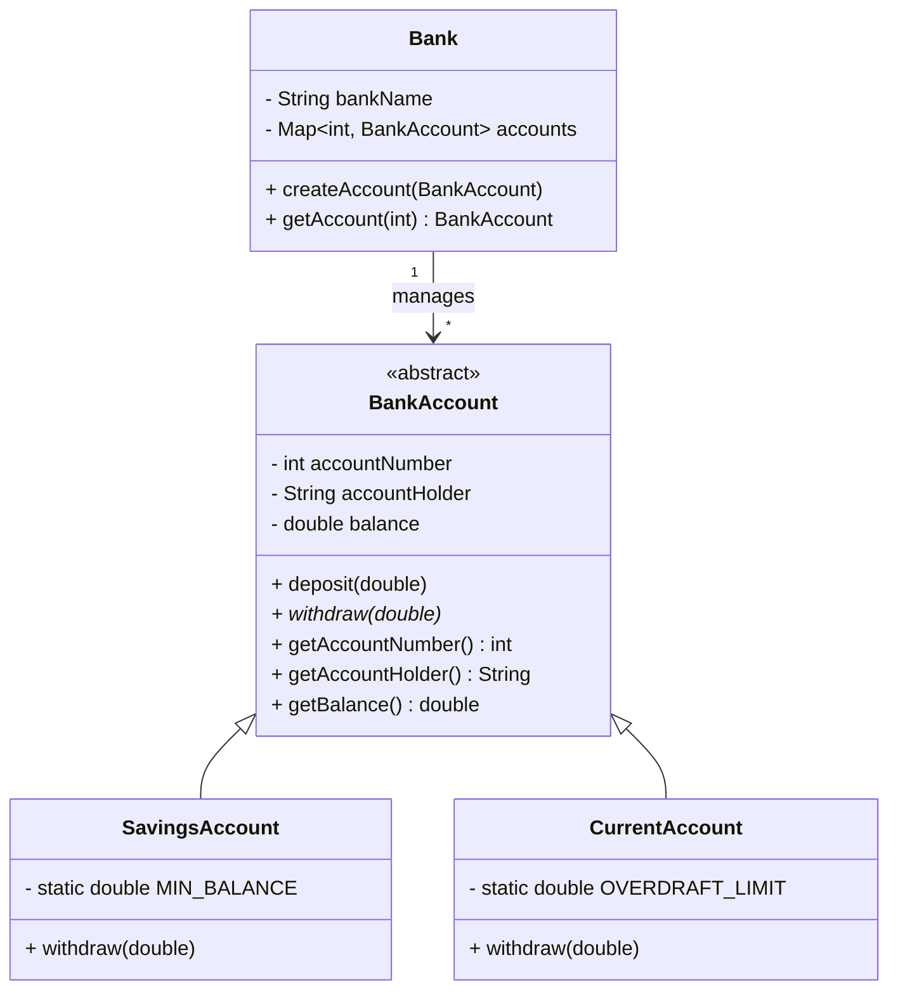

```mermaid

classDiagram

    class Bank {
        - String bankName
        - Map~int, BankAccount~ accounts
        + createAccount(BankAccount)
        + getAccount(int) BankAccount
    }

    class BankAccount {
        <<abstract>>
        - int accountNumber
        - String accountHolder
        - double balance
        + deposit(double)
        + withdraw(double)*
        + getAccountNumber() int
        + getAccountHolder() String
        + getBalance() double
    }

    class SavingsAccount {
        - static double MIN_BALANCE
        + withdraw(double)
    }

    class CurrentAccount {
        - static double OVERDRAFT_LIMIT
        + withdraw(double)
    }

    Bank "1" --> "*" BankAccount : manages
    BankAccount <|-- SavingsAccount
    BankAccount <|-- CurrentAccount

```