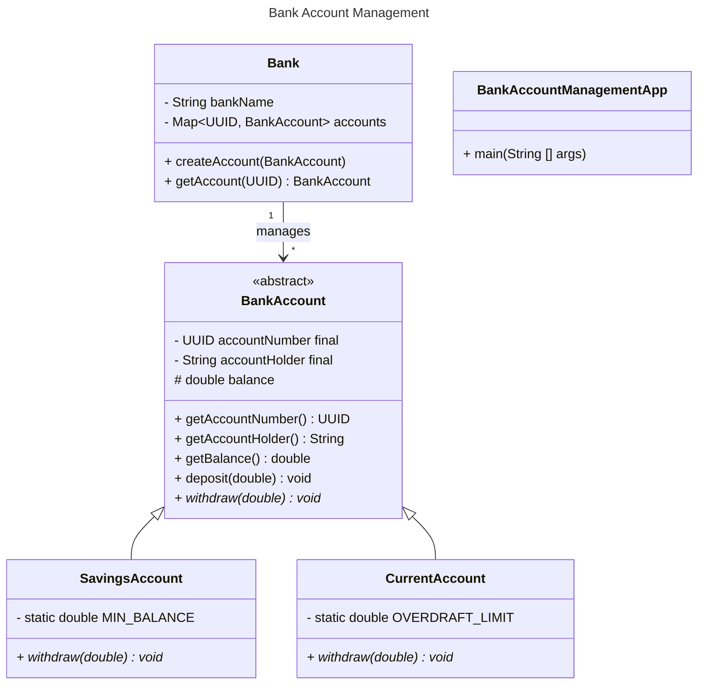

```mermaid
---
title: Bank Account Management
---
classDiagram
direction TB
    class BankAccount {
	    - UUID accountNumber final
	    - String accountHolder final
	    # double balance
	    + getAccountNumber() UUID
	    + getAccountHolder() String
	    + getBalance() double
	    + deposit(double) void
	    + withdraw(double) void* 
    }
    class SavingsAccount {
	    - static double MIN_BALANCE
	    + withdraw(double) void*
    }
    class CurrentAccount {
	    - static double OVERDRAFT_LIMIT
	    + withdraw(double) void*
    }
    class Bank {
	    - String bankName
	    - Map~UUID, BankAccount~ accounts
	    + createAccount(BankAccount)
	    + getAccount(UUID) BankAccount
    }
    class BankAccountManagementApp {
	    + main(String [] args)
    }

	<<abstract>> BankAccount

    BankAccount <|-- SavingsAccount
    BankAccount <|-- CurrentAccount
    Bank "1" --> "*" BankAccount : manages
```