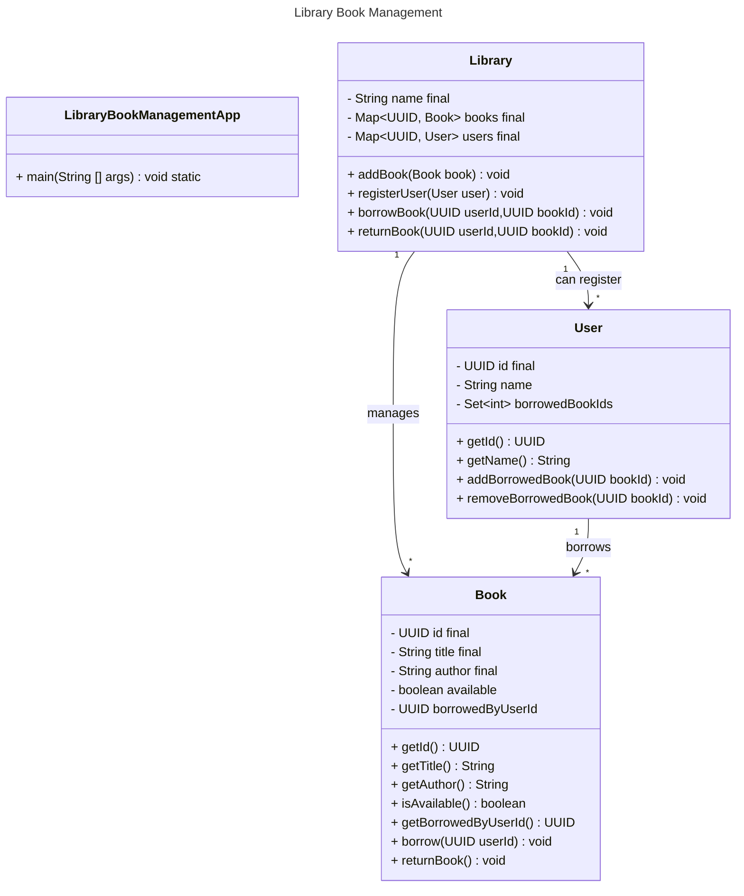

```mermaid
---
title: Library Book Management
---
classDiagram
direction TB
    class Book {
	    - UUID id final
	    - String title final
	    - String author final
	    - boolean available
	    - UUID borrowedByUserId
	    + getId() UUID
	    + getTitle() String
	    + getAuthor() String
	    + isAvailable() boolean
	    + getBorrowedByUserId() UUID
	    + borrow(UUID userId) void
	    + returnBook() void
    }
    class User {
	    - UUID id final
	    - String name
	    - Set~int~ borrowedBookIds
	    + getId() UUID
	    + getName() String
	    + addBorrowedBook(UUID bookId) void
	    + removeBorrowedBook(UUID bookId) void
    }
    class LibraryBookManagementApp {
	    + main(String [] args) void static
    }
    class Library {
	    - String name final
	    - Map~UUID, Book~ books final
	    - Map~UUID, User~ users final
	    + addBook(Book book) void
	    + registerUser(User user) void
	    + borrowBook(UUID userId,UUID bookId) void
	    + returnBook(UUID userId,UUID bookId) void
    }

    Library "1" --> "*" Book : manages
    User "1" --> "*" Book : borrows
    Library "1" --> "*" User : can register
```