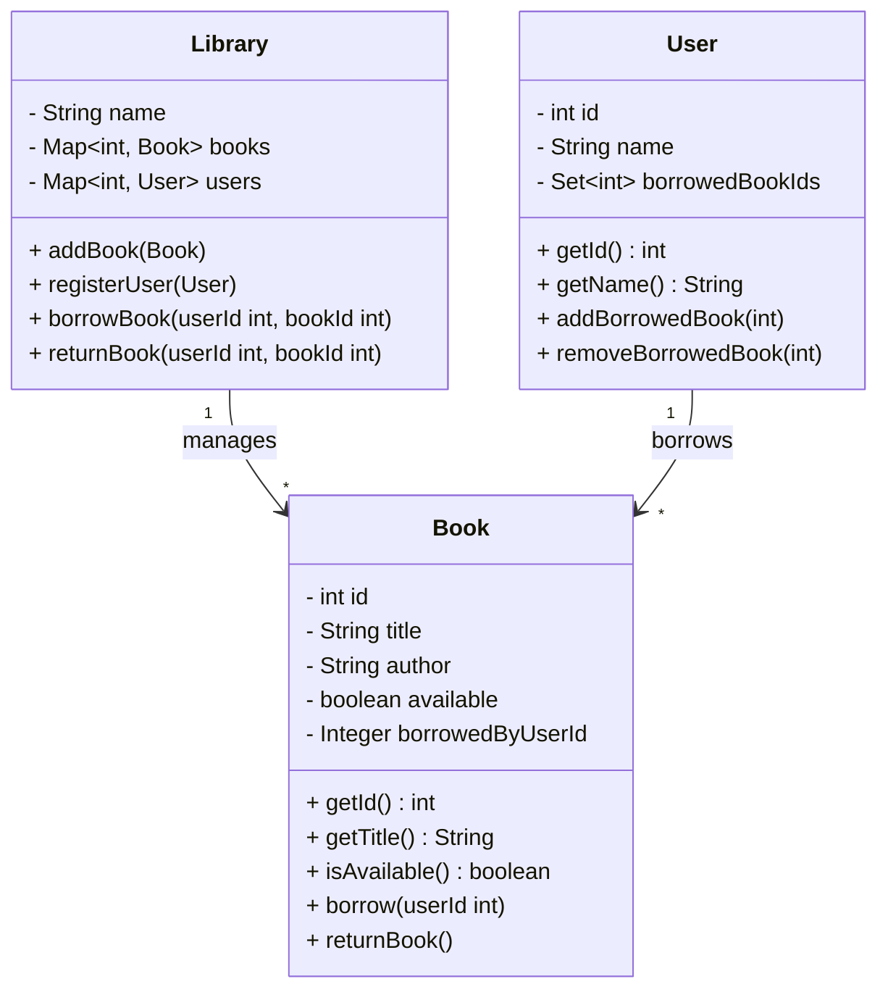

```mermaid

classDiagram

    class Library {
        - String name
        - Map~int, Book~ books
        - Map~int, User~ users
        + addBook(Book)
        + registerUser(User)
        + borrowBook(userId int, bookId int)
        + returnBook(userId int, bookId int)
    }

    class Book {
        - int id
        - String title
        - String author
        - boolean available
        - Integer borrowedByUserId
        + getId() int
        + getTitle() String
        + isAvailable() boolean
        + borrow(userId int)
        + returnBook()
    }

    class User {
        - int id
        - String name
        - Set~int~ borrowedBookIds
        + getId() int
        + getName() String
        + addBorrowedBook(int)
        + removeBorrowedBook(int)
    }

    Library "1" --> "*" Book : manages
    User "1" --> "*" Book : borrows

```
