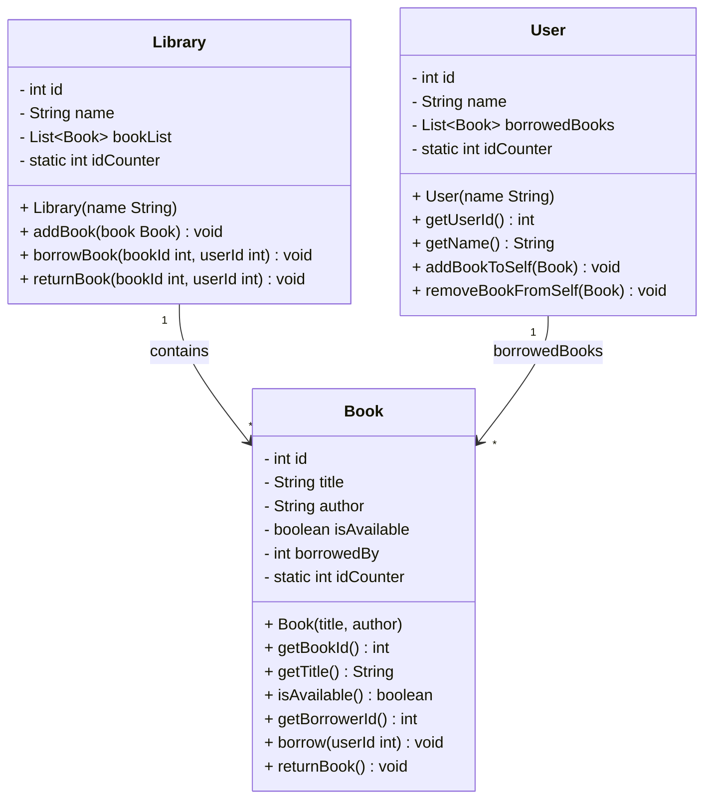

```mermaid

classDiagram
    class Book {
        - int id
        - String title
        - String author
        - boolean isAvailable
        - int borrowedBy
        - static int idCounter
        + Book(title, author)
        + getBookId() int
        + getTitle() String
        + isAvailable() boolean
        + getBorrowerId() int
        + borrow(userId int) void
        + returnBook() void
    }

    class Library {
        - int id
        - String name
        - List~Book~ bookList
        - static int idCounter
        + Library(name String)
        + addBook(book Book) void
        + borrowBook(bookId int, userId int) void
        + returnBook(bookId int, userId int) void
    }

    class User {
        - int id
        - String name
        - List~Book~ borrowedBooks
        - static int idCounter
        + User(name String)
        + getUserId() int
        + getName() String
        + addBookToSelf(Book) void
        + removeBookFromSelf(Book) void
    }

    Library "1" --> "*" Book : contains
    User "1" --> "*" Book : borrowedBooks

```