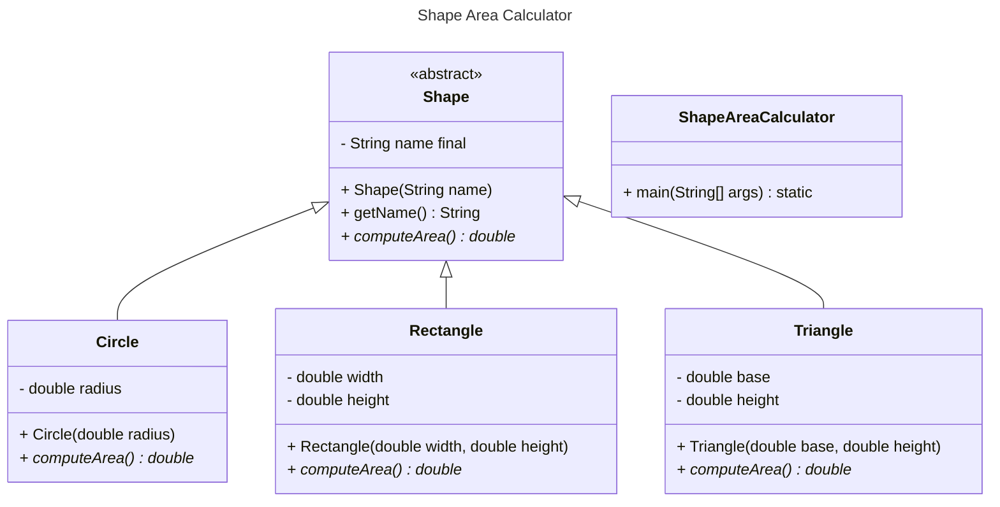

```mermaid
---
title: Shape Area Calculator
---
classDiagram
direction TB
    class Shape {
        - String name final
        + Shape(String name)
        + getName() String
        + computeArea() double*
    }
    class Circle {
        - double radius
        + Circle(double radius)
        + computeArea() double*
    }
    class Rectangle {
        - double width
        - double height
        + Rectangle(double width, double height)
        + computeArea() double*
    }
    class Triangle {
        - double base
        - double height
        + Triangle(double base, double height)
        + computeArea() double*
    }
    class ShapeAreaCalculator {
        + main(String[] args) static
    }
    <<abstract>> Shape
    Shape <|-- Circle
    Shape <|-- Rectangle
    Shape <|-- Triangle
```