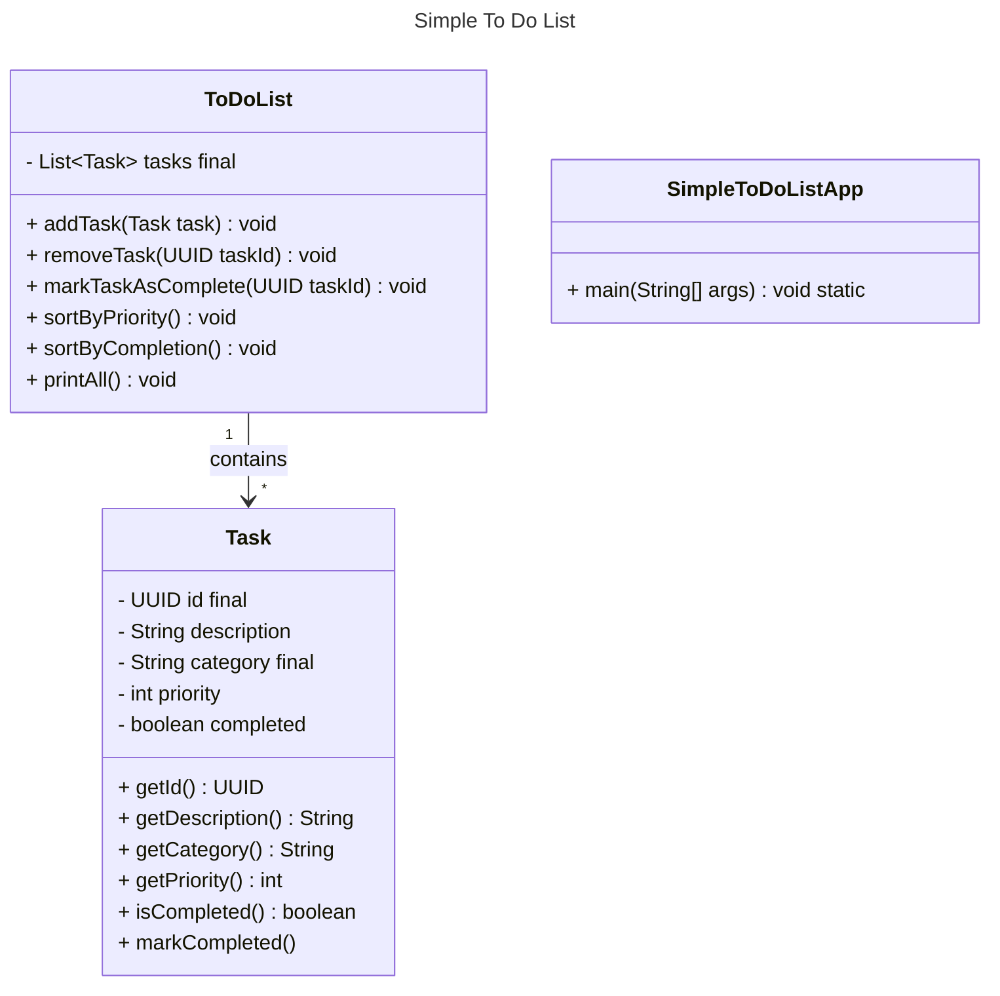

```mermaid
---
title: Simple To Do List
---
classDiagram
direction TB
    class ToDoList {
        - List~Task~ tasks final
        + addTask(Task task) void
        + removeTask(UUID taskId) void
        + markTaskAsComplete(UUID taskId) void
        + sortByPriority() void
        + sortByCompletion() void
        + printAll() void
    }
    class Task {
        - UUID id final
        - String description
        - String category final
        - int priority
        - boolean completed
        + getId() UUID
        + getDescription() String
        + getCategory() String
        + getPriority() int
        + isCompleted() boolean
        + markCompleted()
    }
    class SimpleToDoListApp {
        + main(String[] args) void static
    }
    ToDoList "1" --> "*" Task : contains
```