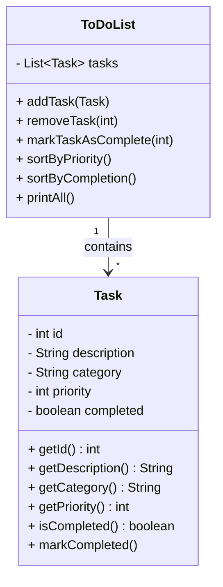

```mermaid

classDiagram

    class ToDoList {
        - List~Task~ tasks
        + addTask(Task)
        + removeTask(int)
        + markTaskAsComplete(int)
        + sortByPriority()
        + sortByCompletion()
        + printAll()
    }

    class Task {
        - int id
        - String description
        - String category
        - int priority
        - boolean completed
        + getId() int
        + getDescription() String
        + getCategory() String
        + getPriority() int
        + isCompleted() boolean
        + markCompleted()
    }

    ToDoList "1" --> "*" Task : contains

```