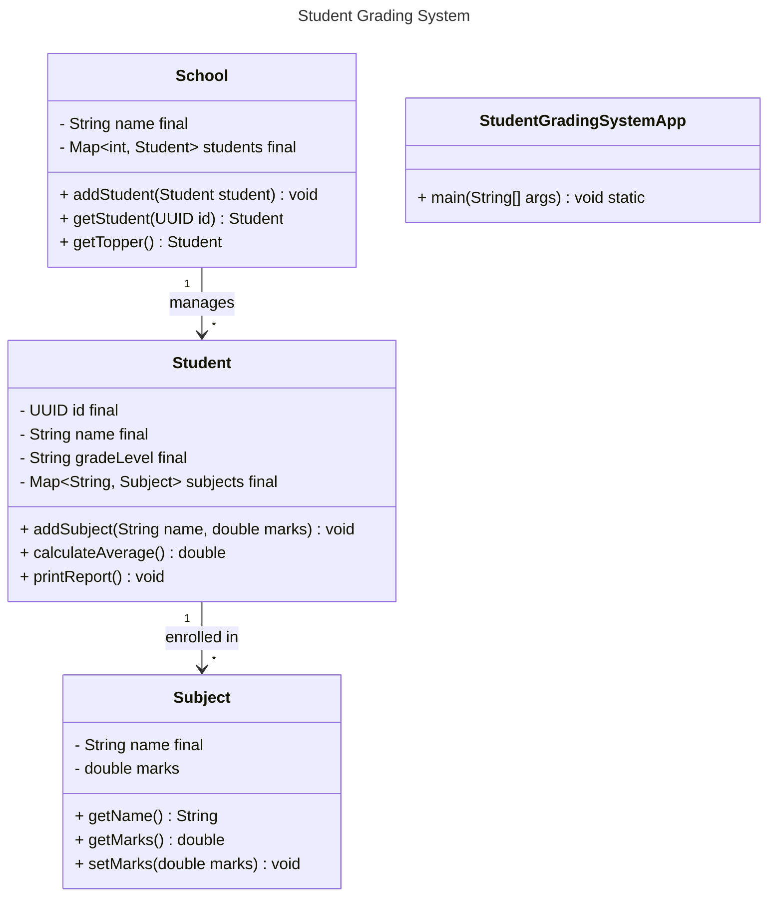

```mermaid
---
title: Student Grading System
---
classDiagram
direction TB
    class School {
        - String name final
        - Map~int, Student~ students final
        + addStudent(Student student) void
        + getStudent(UUID id) Student
        + getTopper() Student
    }
    class Student {
        - UUID id final
        - String name final
        - String gradeLevel final
        - Map~String, Subject~ subjects final
        + addSubject(String name, double marks) void
        + calculateAverage() double
        + printReport() void
    }
    class Subject {
        - String name final
        - double marks
        + getName() String
        + getMarks() double
        + setMarks(double marks) void 
    }
    class StudentGradingSystemApp {
        + main(String[] args) void static
    }
    School "1" --> "*" Student : manages
    Student "1" --> "*" Subject : enrolled in
```