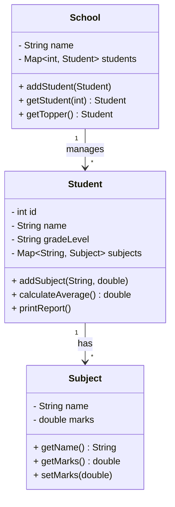

```mermaid

classDiagram

    class School {
        - String name
        - Map~int, Student~ students
        + addStudent(Student)
        + getStudent(int) Student
        + getTopper() Student
    }

    class Student {
        - int id
        - String name
        - String gradeLevel
        - Map~String, Subject~ subjects
        + addSubject(String, double)
        + calculateAverage() double
        + printReport()
    }

    class Subject {
        - String name
        - double marks
        + getName() String
        + getMarks() double
        + setMarks(double)
    }

    School "1" --> "*" Student : manages
    Student "1" --> "*" Subject : has

```