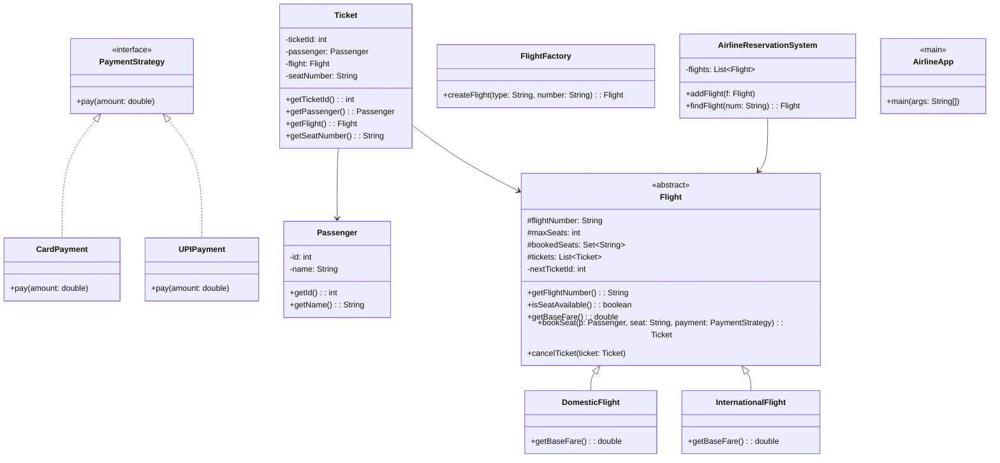

```mermaid

classDiagram
    %% ===================== Interfaces =====================
    class PaymentStrategy {
        <<interface>>
        +pay(amount: double)
    }

    class CardPayment {
        +pay(amount: double)
    }

    class UPIPayment {
        +pay(amount: double)
    }

    PaymentStrategy <|.. CardPayment
    PaymentStrategy <|.. UPIPayment

    %% ===================== Passenger =====================
    class Passenger {
        -id: int
        -name: String
        +getId(): int
        +getName(): String
    }

    %% ===================== Ticket =====================
    class Ticket {
        -ticketId: int
        -passenger: Passenger
        -flight: Flight
        -seatNumber: String
        +getTicketId(): int
        +getPassenger(): Passenger
        +getFlight(): Flight
        +getSeatNumber(): String
    }

    Ticket --> Passenger
    Ticket --> Flight

    %% ===================== Abstract Flight =====================
    class Flight {
        <<abstract>>
        #flightNumber: String
        #maxSeats: int
        #bookedSeats: Set~String~
        #tickets: List~Ticket~
        -nextTicketId: int
        +getFlightNumber(): String
        +isSeatAvailable(): boolean
        +getBaseFare(): double
        +bookSeat(p: Passenger, seat: String, payment: PaymentStrategy): Ticket
        +cancelTicket(ticket: Ticket)
    }

    class DomesticFlight {
        +getBaseFare(): double
    }

    class InternationalFlight {
        +getBaseFare(): double
    }

    Flight <|-- DomesticFlight
    Flight <|-- InternationalFlight

    %% ===================== Flight Factory =====================
    class FlightFactory {
        +createFlight(type: String, number: String): Flight
    }

    %% ===================== Airline Reservation System =====================
    class AirlineReservationSystem {
        -flights: List~Flight~
        +addFlight(f: Flight)
        +findFlight(num: String): Flight
    }

    AirlineReservationSystem --> Flight

    %% ===================== Main App =====================
    class AirlineApp {
        <<main>>
        +main(args: String[])
    }

```