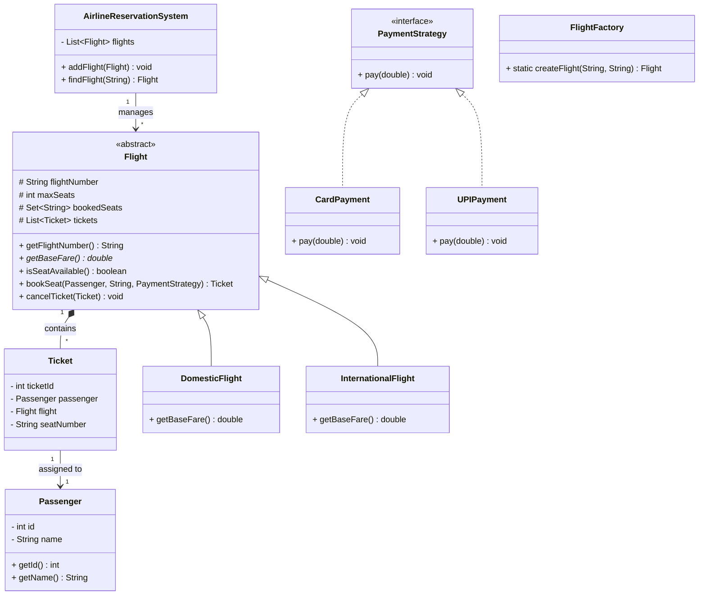

```mermaid

classDiagram

    class AirlineReservationSystem {
        - List~Flight~ flights
        + addFlight(Flight) void
        + findFlight(String) Flight
    }

    class Passenger {
        - int id
        - String name
        + getId() int
        + getName() String
    }

    class Ticket {
        - int ticketId
        - Passenger passenger
        - Flight flight
        - String seatNumber
    }

    class Flight {
        <<abstract>>
        # String flightNumber
        # int maxSeats
        # Set~String~ bookedSeats
        # List~Ticket~ tickets
        + getFlightNumber() String
        + getBaseFare() double*
        + isSeatAvailable() boolean
        + bookSeat(Passenger, String, PaymentStrategy) Ticket
        + cancelTicket(Ticket) void
    }

    class DomesticFlight {
        + getBaseFare() double
    }

    class InternationalFlight {
        + getBaseFare() double
    }

    class PaymentStrategy {
        <<interface>>
        + pay(double) void
    }

    class CardPayment {
        + pay(double) void
    }

    class UPIPayment {
        + pay(double) void
    }

    class FlightFactory {
        + static createFlight(String, String) Flight
    }

    Flight "1" *-- "*" Ticket : contains
    Ticket "1" --> "1" Passenger : assigned to
    AirlineReservationSystem "1" --> "*" Flight : manages

    Flight <|-- DomesticFlight
    Flight <|-- InternationalFlight

    PaymentStrategy <|.. CardPayment
    PaymentStrategy <|.. UPIPayment

```