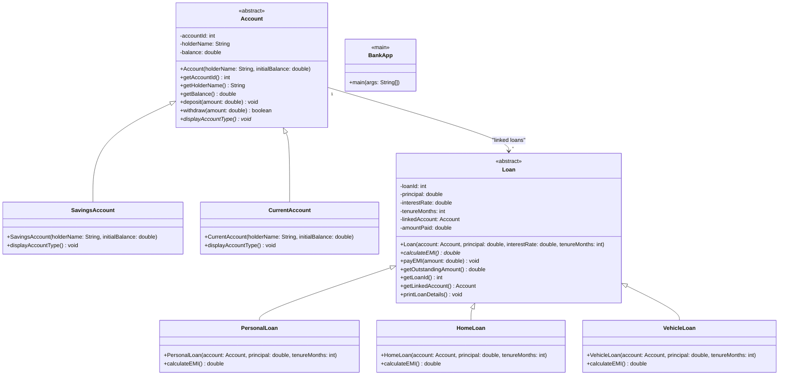

```mermaid

classDiagram

    %% ====================== ABSTRACT ACCOUNT ======================
    class Account {
        <<abstract>>
        -accountId: int
        -holderName: String
        -balance: double

        +Account(holderName: String, initialBalance: double)
        +getAccountId() int
        +getHolderName() String
        +getBalance() double
        +deposit(amount: double) void
        +withdraw(amount: double) boolean
        +displayAccountType() void*
    }

    %% ====================== ACCOUNT TYPES ======================
    class SavingsAccount {
        +SavingsAccount(holderName: String, initialBalance: double)
        +displayAccountType() void
    }

    class CurrentAccount {
        +CurrentAccount(holderName: String, initialBalance: double)
        +displayAccountType() void
    }

    Account <|-- SavingsAccount
    Account <|-- CurrentAccount


    %% ====================== ABSTRACT LOAN ======================
    class Loan {
        <<abstract>>
        -loanId: int
        -principal: double
        -interestRate: double
        -tenureMonths: int
        -linkedAccount: Account
        -amountPaid: double

        +Loan(account: Account, principal: double, interestRate: double, tenureMonths: int)
        +calculateEMI() double*
        +payEMI(amount: double) void
        +getOutstandingAmount() double
        +getLoanId() int
        +getLinkedAccount() Account
        +printLoanDetails() void
    }

    %% ====================== LOAN TYPES ======================
    class PersonalLoan {
        +PersonalLoan(account: Account, principal: double, tenureMonths: int)
        +calculateEMI() double
    }

    class HomeLoan {
        +HomeLoan(account: Account, principal: double, tenureMonths: int)
        +calculateEMI() double
    }

    class VehicleLoan {
        +VehicleLoan(account: Account, principal: double, tenureMonths: int)
        +calculateEMI() double
    }

    Loan <|-- PersonalLoan
    Loan <|-- HomeLoan
    Loan <|-- VehicleLoan

    %% ====================== ASSOCIATIONS ======================
    Account "1" --> "*" Loan : "linked loans"


    %% ====================== MAIN APP ======================
    class BankApp {
        <<main>>
        +main(args: String[])
    }

```