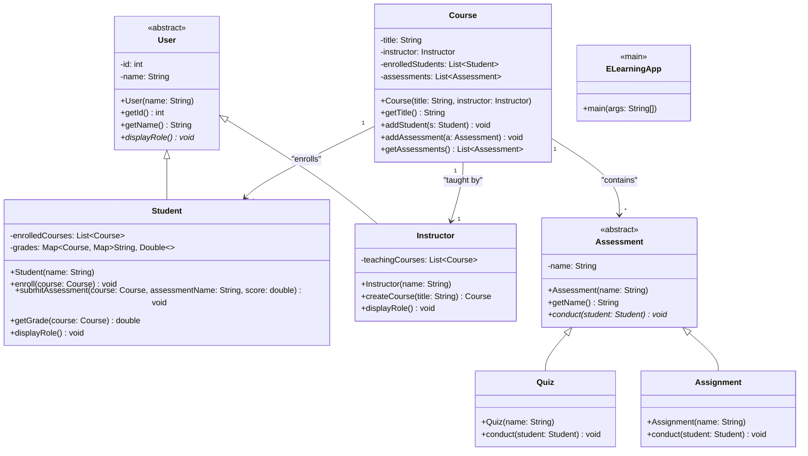

```mermaid

classDiagram

    %% ====================== ABSTRACT USER ======================
    class User {
        <<abstract>>
        -id: int
        -name: String

        +User(name: String)
        +getId() int
        +getName() String
        +displayRole() void*
    }

    %% ====================== STUDENT ======================
    class Student {
        -enrolledCourses: List~Course~
        -grades: Map~Course, Map~String, Double~~

        +Student(name: String)
        +enroll(course: Course) void
        +submitAssessment(course: Course, assessmentName: String, score: double) void
        +getGrade(course: Course) double
        +displayRole() void
    }

    %% ====================== INSTRUCTOR ======================
    class Instructor {
        -teachingCourses: List~Course~

        +Instructor(name: String)
        +createCourse(title: String) Course
        +displayRole() void
    }

    User <|-- Student
    User <|-- Instructor

    %% ====================== COURSE ======================
    class Course {
        -title: String
        -instructor: Instructor
        -enrolledStudents: List~Student~
        -assessments: List~Assessment~

        +Course(title: String, instructor: Instructor)
        +getTitle() String
        +addStudent(s: Student) void
        +addAssessment(a: Assessment) void
        +getAssessments() List~Assessment~
    }

    Course "1" --> "1" Instructor : "taught by"
    Course "1" --> "*" Student : "enrolls"
    Course "1" --> "*" Assessment : "contains"

    %% ====================== ASSESSMENTS (Abstract + Types) ======================
    class Assessment {
        <<abstract>>
        -name: String

        +Assessment(name: String)
        +getName() String
        +conduct(student: Student) void*
    }

    class Quiz {
        +Quiz(name: String)
        +conduct(student: Student) void
    }

    class Assignment {
        +Assignment(name: String)
        +conduct(student: Student) void
    }

    Assessment <|-- Quiz
    Assessment <|-- Assignment

    %% ====================== MAIN APP ======================
    class ELearningApp {
        <<main>>
        +main(args: String[])
    }

```