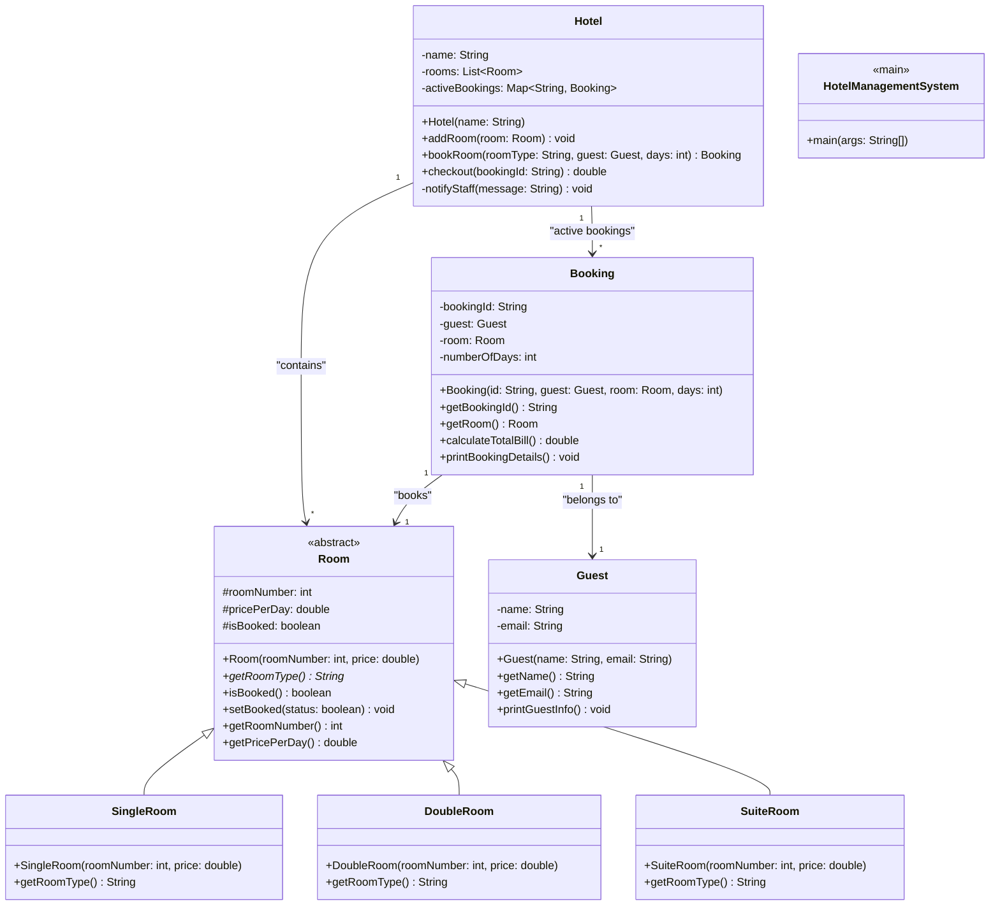

```mermaid

classDiagram

    %% ====================== HOTEL (Core Manager Class) ======================
    class Hotel {
        -name: String
        -rooms: List~Room~
        -activeBookings: Map~String, Booking~

        +Hotel(name: String)
        +addRoom(room: Room) void
        +bookRoom(roomType: String, guest: Guest, days: int) Booking
        +checkout(bookingId: String) double
        -notifyStaff(message: String) void
    }

    Hotel "1" --> "*" Room : "contains"
    Hotel "1" --> "*" Booking : "active bookings"


    %% ====================== ROOM HIERARCHY ======================
    class Room {
        <<abstract>>
        #roomNumber: int
        #pricePerDay: double
        #isBooked: boolean

        +Room(roomNumber: int, price: double)
        +getRoomType() String*
        +isBooked() boolean
        +setBooked(status: boolean) void
        +getRoomNumber() int
        +getPricePerDay() double
    }

    class SingleRoom {
        +SingleRoom(roomNumber: int, price: double)
        +getRoomType() String
    }

    class DoubleRoom {
        +DoubleRoom(roomNumber: int, price: double)
        +getRoomType() String
    }

    class SuiteRoom {
        +SuiteRoom(roomNumber: int, price: double)
        +getRoomType() String
    }

    Room <|-- SingleRoom
    Room <|-- DoubleRoom
    Room <|-- SuiteRoom


    %% ====================== GUEST ======================
    class Guest {
        -name: String
        -email: String

        +Guest(name: String, email: String)
        +getName() String
        +getEmail() String
        +printGuestInfo() void
    }


    %% ====================== BOOKING (Composition) ======================
    class Booking {
        -bookingId: String
        -guest: Guest
        -room: Room
        -numberOfDays: int

        +Booking(id: String, guest: Guest, room: Room, days: int)
        +getBookingId() String
        +getRoom() Room
        +calculateTotalBill() double
        +printBookingDetails() void
    }

    Booking "1" --> "1" Guest : "belongs to"
    Booking "1" --> "1" Room : "books"


    %% ====================== MAIN APP ======================
    class HotelManagementSystem {
        <<main>>
        +main(args: String[])
    }

```
