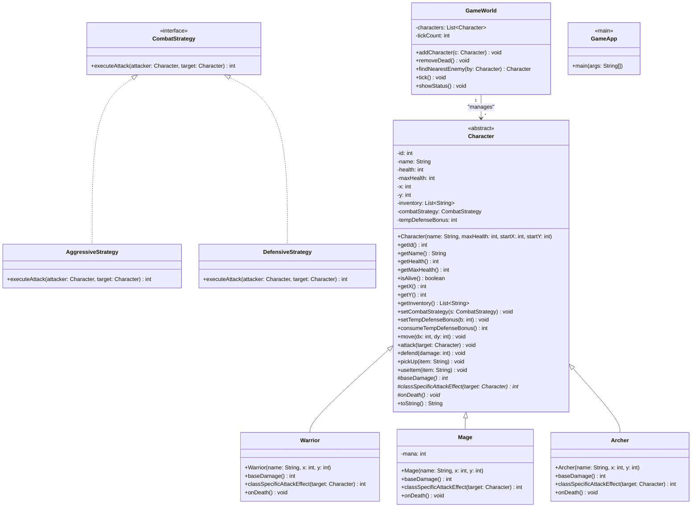

```mermaid

classDiagram

    %% ====================== Combat Strategies (Strategy Pattern) ======================
    class CombatStrategy {
        <<interface>>
        +executeAttack(attacker: Character, target: Character) int
    }

    class AggressiveStrategy {
        +executeAttack(attacker: Character, target: Character) int
    }

    class DefensiveStrategy {
        +executeAttack(attacker: Character, target: Character) int
    }

    CombatStrategy <|.. AggressiveStrategy
    CombatStrategy <|.. DefensiveStrategy


    %% ====================== Abstract Character ======================
    class Character {
        <<abstract>>
        -id: int
        -name: String
        -health: int
        -maxHealth: int
        -x: int
        -y: int
        -inventory: List~String~
        -combatStrategy: CombatStrategy
        -tempDefenseBonus: int

        +Character(name: String, maxHealth: int, startX: int, startY: int)
        +getId() int
        +getName() String
        +getHealth() int
        +getMaxHealth() int
        +isAlive() boolean
        +getX() int
        +getY() int
        +getInventory() List~String~
        +setCombatStrategy(s: CombatStrategy) void
        +setTempDefenseBonus(b: int) void
        +consumeTempDefenseBonus() int
        +move(dx: int, dy: int) void
        +attack(target: Character) void
        +defend(damage: int) void
        +pickUp(item: String) void
        +useItem(item: String) void

        #baseDamage() int*
        #classSpecificAttackEffect(target: Character) int*
        #onDeath() void*

        +toString() String
    }


    %% ====================== Character Types (Inheritance) ======================
    class Warrior {
        +Warrior(name: String, x: int, y: int)
        +baseDamage() int
        +classSpecificAttackEffect(target: Character) int
        +onDeath() void
    }

    class Mage {
        -mana: int
        +Mage(name: String, x: int, y: int)
        +baseDamage() int
        +classSpecificAttackEffect(target: Character) int
        +onDeath() void
    }

    class Archer {
        +Archer(name: String, x: int, y: int)
        +baseDamage() int
        +classSpecificAttackEffect(target: Character) int
        +onDeath() void
    }

    Character <|-- Warrior
    Character <|-- Mage
    Character <|-- Archer


    %% ====================== Game World ======================
    class GameWorld {
        -characters: List~Character~
        -tickCount: int
        +addCharacter(c: Character) void
        +removeDead() void
        +findNearestEnemy(by: Character) Character
        +tick() void
        +showStatus() void
    }

    GameWorld "1" --> "*" Character : "manages"


    %% ====================== Game Application (Main) ======================
    class GameApp {
        <<main>>
        +main(args: String[])
    }

```