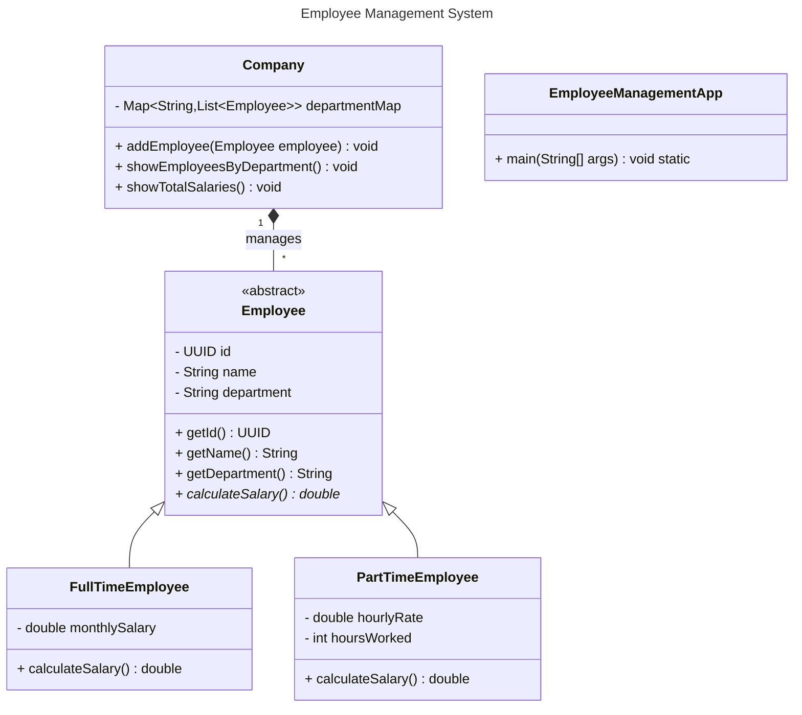

```mermaid
---
title: Employee Management System
---
classDiagram
direction TB
    class Employee {
        - UUID id
        - String name
        - String department
        + getId() UUID
        + getName() String
        + getDepartment() String
        + calculateSalary() double*
    }
    class FullTimeEmployee {
        - double monthlySalary
        + calculateSalary() double
    }
    class PartTimeEmployee {
        - double hourlyRate
        - int hoursWorked
        + calculateSalary() double
    }
    class Company {
        - Map&lt;String,List&lt;Employee&gt;&gt; departmentMap
        + addEmployee(Employee employee) void
        + showEmployeesByDepartment() void
        + showTotalSalaries() void
    }
	class EmployeeManagementApp {
		+ main(String[] args) void static
	}
    <<abstract>> Employee
    Employee <|-- FullTimeEmployee
    Employee <|-- PartTimeEmployee
    Company "1" *-- "*" Employee : manages
```
