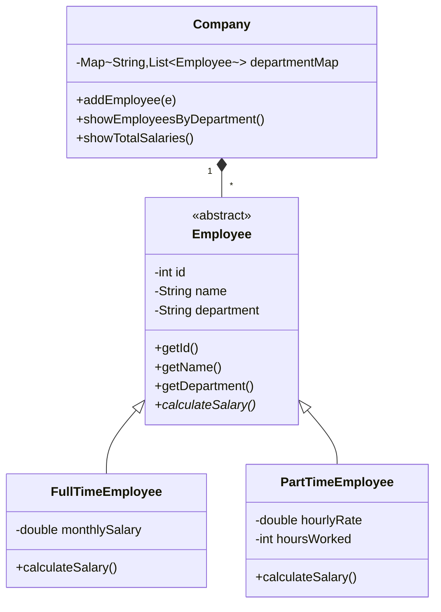

```mermaid

classDiagram
    class Employee {
        <<abstract>>
        -int id
        -String name
        -String department
        +getId()
        +getName()
        +getDepartment()
        +calculateSalary()*
    }

    class FullTimeEmployee {
        -double monthlySalary
        +calculateSalary()
    }

    class PartTimeEmployee {
        -double hourlyRate
        -int hoursWorked
        +calculateSalary()
    }

    class Company {
        -Map~String,List~Employee~~ departmentMap
        +addEmployee(e)
        +showEmployeesByDepartment()
        +showTotalSalaries()
    }

    Employee <|-- FullTimeEmployee
    Employee <|-- PartTimeEmployee

    Company "1" *-- "*" Employee

```
