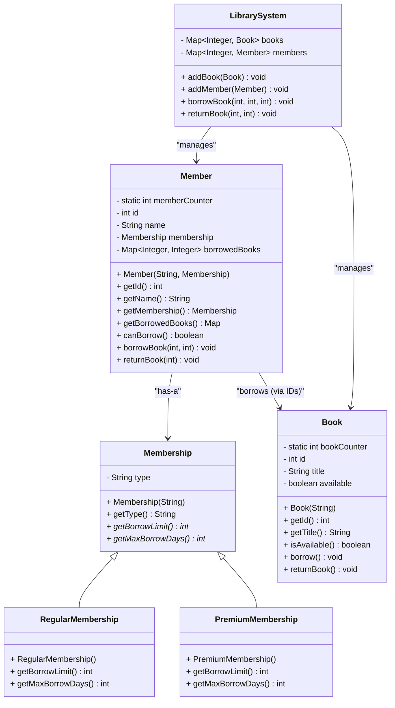

```mermaid

classDiagram
    direction TB

    class Membership {
        - String type
        + Membership(String)
        + getType() String
        + getBorrowLimit() int*
        + getMaxBorrowDays() int*
    }

    class RegularMembership {
        + RegularMembership()
        + getBorrowLimit() int
        + getMaxBorrowDays() int
    }

    class PremiumMembership {
        + PremiumMembership()
        + getBorrowLimit() int
        + getMaxBorrowDays() int
    }

    class Book {
        - static int bookCounter
        - int id
        - String title
        - boolean available
        + Book(String)
        + getId() int
        + getTitle() String
        + isAvailable() boolean
        + borrow() void
        + returnBook() void
    }

    class Member {
        - static int memberCounter
        - int id
        - String name
        - Membership membership
        - Map~Integer, Integer~ borrowedBooks
        + Member(String, Membership)
        + getId() int
        + getName() String
        + getMembership() Membership
        + getBorrowedBooks() Map
        + canBorrow() boolean
        + borrowBook(int, int) void
        + returnBook(int) void
    }

    class LibrarySystem {
        - Map~Integer, Book~ books
        - Map~Integer, Member~ members
        + addBook(Book) void
        + addMember(Member) void
        + borrowBook(int, int, int) void
        + returnBook(int, int) void
    }

    %% Relationships
    Membership <|-- RegularMembership
    Membership <|-- PremiumMembership

    Member --> Membership : "has-a"
    LibrarySystem --> Book : "manages"
    LibrarySystem --> Member : "manages"

    Member --> Book : "borrows (via IDs)"

```
