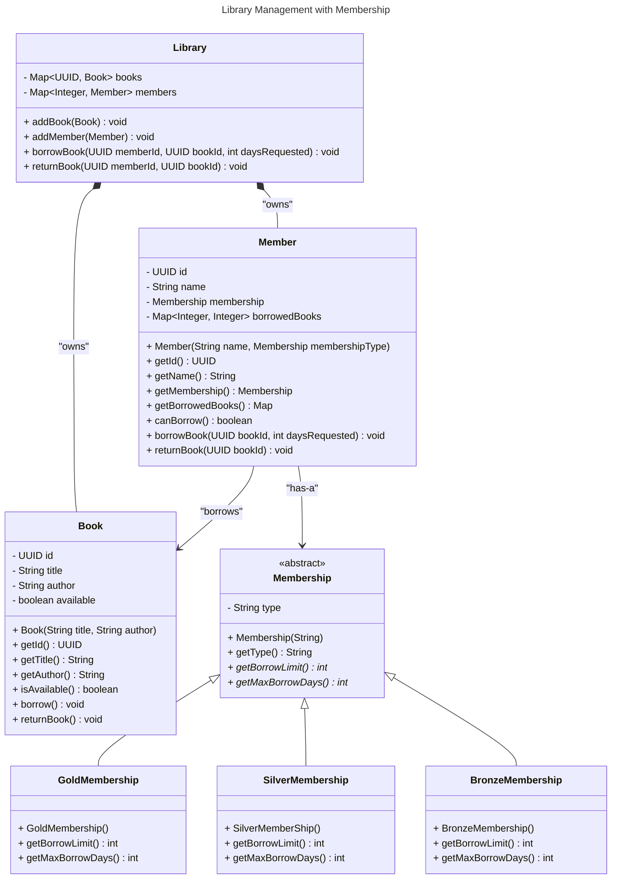

```mermaid
---
title: Library Management with Membership
---
classDiagram
    direction TB
    class Library {
        - Map~UUID, Book~ books
        - Map~Integer, Member~ members
        + addBook(Book) void
        + addMember(Member) void
        + borrowBook(UUID memberId, UUID bookId, int daysRequested) void
        + returnBook(UUID memberId, UUID bookId) void
    }
    class Book {
        - UUID id
        - String title
        - String author
        - boolean available
        + Book(String title, String author)
        + getId() UUID
        + getTitle() String
        + getAuthor() String
        + isAvailable() boolean
        + borrow() void
        + returnBook() void
    }
    class Member {
        - UUID id
        - String name
        - Membership membership
        - Map~Integer, Integer~ borrowedBooks
        + Member(String name, Membership membershipType)
        + getId() UUID
        + getName() String
        + getMembership() Membership
        + getBorrowedBooks() Map
        + canBorrow() boolean
        + borrowBook(UUID bookId, int daysRequested) void
        + returnBook(UUID bookId) void
    }
    class Membership {
        <<abstract>>
        - String type
        + Membership(String)
        + getType() String
        + getBorrowLimit() int*
        + getMaxBorrowDays() int*
    }
    class GoldMembership {
        + GoldMembership()
        + getBorrowLimit() int
        + getMaxBorrowDays() int
    }
    class SilverMembership {
        + SilverMemberShip()
        + getBorrowLimit() int
        + getMaxBorrowDays() int
    }
    class BronzeMembership {
        + BronzeMembership()
        + getBorrowLimit() int
        + getMaxBorrowDays() int
    }        

     %% Inheritance
    Membership <|-- GoldMembership
    Membership <|-- SilverMembership
    Membership <|-- BronzeMembership

    %% Composition
    Library *-- Book : "owns"
    Library *-- Member : "owns"

    %% Associations
    Member --> Membership : "has-a"
    Member --> Book : "borrows"
```
