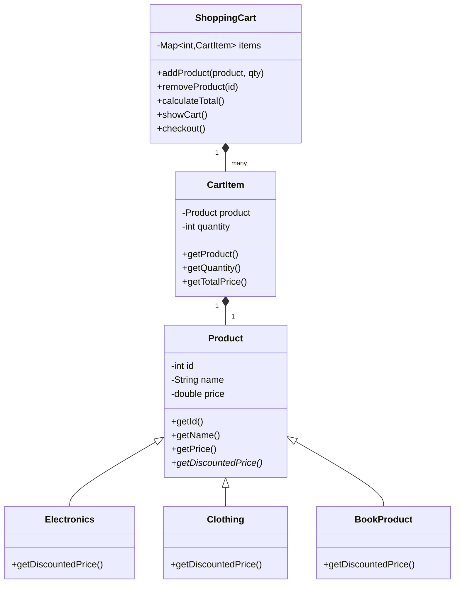

```mermaid

classDiagram
    class Product {
        -int id
        -String name
        -double price
        +getId()
        +getName()
        +getPrice()
        +getDiscountedPrice()*
    }

    class Electronics {
        +getDiscountedPrice()
    }

    class Clothing {
        +getDiscountedPrice()
    }

    class BookProduct {
        +getDiscountedPrice()
    }

    class CartItem {
        -Product product
        -int quantity
        +getProduct()
        +getQuantity()
        +getTotalPrice()
    }

    class ShoppingCart {
        -Map~int,CartItem~ items
        +addProduct(product, qty)
        +removeProduct(id)
        +calculateTotal()
        +showCart()
        +checkout()
    }

    Product <|-- Electronics
    Product <|-- Clothing
    Product <|-- BookProduct

    ShoppingCart "1" *-- "many" CartItem
    CartItem "1" *-- "1" Product

```