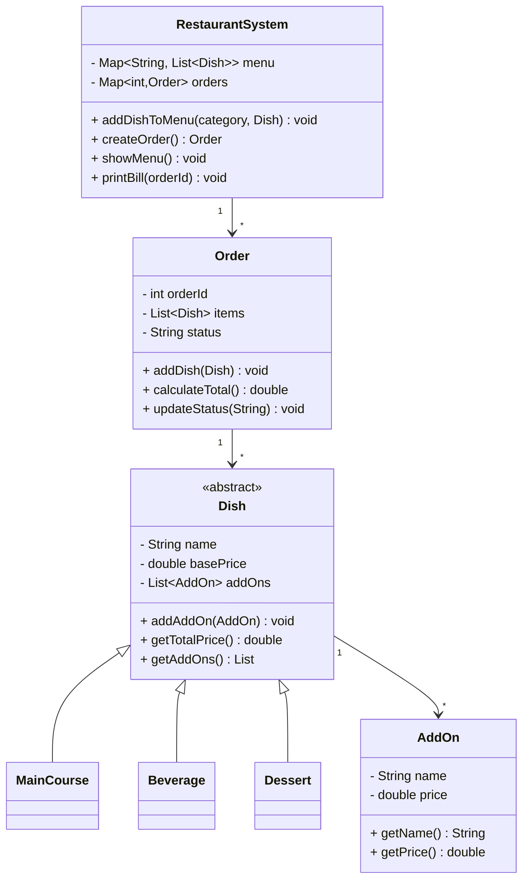

```mermaid

classDiagram

    class AddOn {
        - String name
        - double price
        + getName() String
        + getPrice() double
    }

    class Dish {
        <<abstract>>
        - String name
        - double basePrice
        - List~AddOn~ addOns
        + addAddOn(AddOn) void
        + getTotalPrice() double
        + getAddOns() List
    }

    class MainCourse
    class Beverage
    class Dessert

    Dish <|-- MainCourse
    Dish <|-- Beverage
    Dish <|-- Dessert

    class Order {
        - int orderId
        - List~Dish~ items
        - String status
        + addDish(Dish) void
        + calculateTotal() double
        + updateStatus(String) void
    }

    class RestaurantSystem {
        - Map&lt;String, List&lt;Dish&gt;&gt; menu
        - Map~int,Order~ orders
        + addDishToMenu(category, Dish) void
        + createOrder() Order
        + showMenu() void
        + printBill(orderId) void
    }

    RestaurantSystem "1" --> "*" Order
    Order "1" --> "*" Dish
    Dish "1" --> "*" AddOn

```
