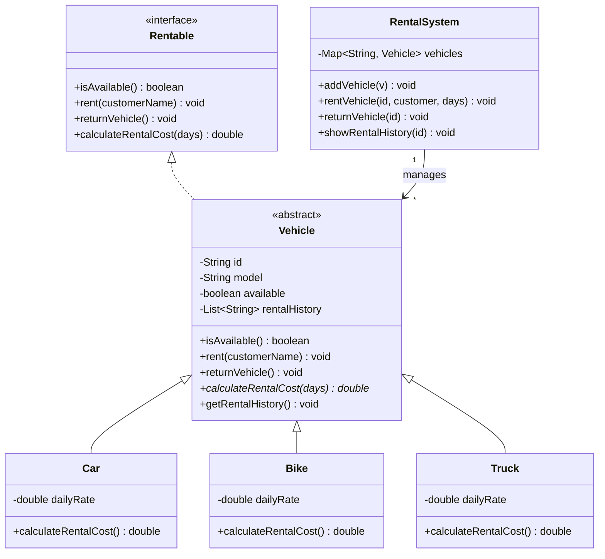

```mermaid

classDiagram

    class Rentable {
        <<interface>>
        +isAvailable() boolean
        +rent(customerName) void
        +returnVehicle() void
        +calculateRentalCost(days) double
    }

    class Vehicle {
        <<abstract>>
        -String id
        -String model
        -boolean available
        -List~String~ rentalHistory
        +isAvailable() boolean
        +rent(customerName) void
        +returnVehicle() void
        +calculateRentalCost(days)* double
        +getRentalHistory() void
    }

    class Car {
        -double dailyRate
        +calculateRentalCost() double
    }

    class Bike {
        -double dailyRate
        +calculateRentalCost() double
    }

    class Truck {
        -double dailyRate
        +calculateRentalCost() double
    }

    class RentalSystem {
        -Map~String, Vehicle~ vehicles
        +addVehicle(v) void
        +rentVehicle(id, customer, days) void
        +returnVehicle(id) void
        +showRentalHistory(id) void
    }

    Rentable <|.. Vehicle
    Vehicle <|-- Car
    Vehicle <|-- Bike
    Vehicle <|-- Truck
    RentalSystem "1" --> "*" Vehicle : manages

```
