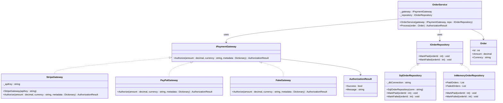

```mermaid
%%{init: {'theme': 'default'}}%%

classDiagram

    %% Interfaces
    class IPaymentGateway {
        +Authorize(amount : decimal, currency : string, metadata : Dictionary<string,string>) AuthorizationResult
    }

    class IOrderRepository {
        +MarkPaid(orderId : int) void
        +MarkFailed(orderId : int) void
    }

    %% Payment Gateway Implementations
    class StripeGateway {
        -_apiKey : string
        +StripeGateway(apiKey : string)
        +Authorize(amount : decimal, currency : string, metadata : Dictionary<string,string>) AuthorizationResult
    }

    class PayPalGateway {
        +Authorize(amount : decimal, currency : string, metadata : Dictionary<string,string>) AuthorizationResult
    }

    %% Repository Implementations
    class SqlOrderRepository {
        -_dbConnection : string
        +SqlOrderRepository(conn : string)
        +MarkPaid(orderId : int) void
        +MarkFailed(orderId : int) void
    }

    %% Business Logic
    class OrderService {
        -_gateway : IPaymentGateway
        -_repository : IOrderRepository
        +OrderService(gateway : IPaymentGateway, repo : IOrderRepository)
        +Process(order : Order) AuthorizationResult
    }

    %% Models
    class Order {
        +Id : int
        +Amount : decimal
        +Currency : string
    }

    class AuthorizationResult {
        +Success : bool
        +Message : string
    }

    %% Test Doubles
    class FakeGateway {
        +Authorize(amount : decimal, currency : string, metadata : Dictionary<string,string>) AuthorizationResult
    }

    class InMemoryOrderRepository {
        +PaidOrders : List<int>
        +FailedOrders : List<int>
        +MarkPaid(orderId : int) void
        +MarkFailed(orderId : int) void
    }

    %% DI Relationships
    IPaymentGateway <|.. StripeGateway
    IPaymentGateway <|.. PayPalGateway
    IOrderRepository <|.. SqlOrderRepository

    IOrderRepository <|.. InMemoryOrderRepository
    IPaymentGateway <|.. FakeGateway

    OrderService --> IPaymentGateway : uses
    OrderService --> IOrderRepository : uses
    OrderService --> Order
    IPaymentGateway --> AuthorizationResult
```